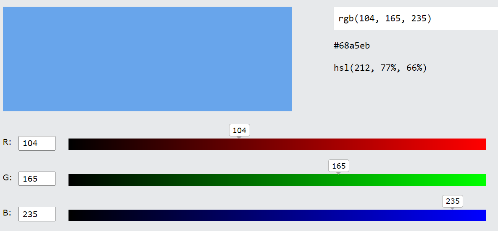

# CSS COLOR
When using CSS, you can simply write the names of certain colors to apply them to an element. However, for more specific colors, writing their names won't be sufficient. To solve this issue, color codes are used.

## CSS COLOR CODE

To use RGB colors, you should use the rgb() function. It should be written as color: rgb(R,G,B). Here, R represents Red, G represents Green, and B represents Blue. The values for R, G, and B should be written with commas in between and must be between 0 and 255.Another method is to use the '#' symbol to specify a color.

