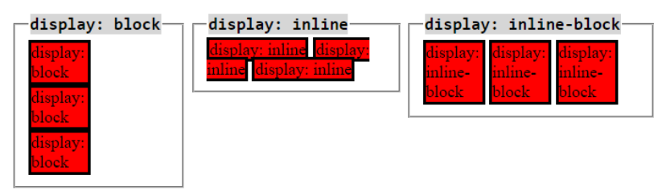
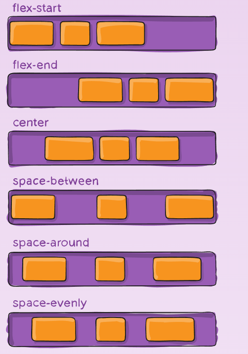
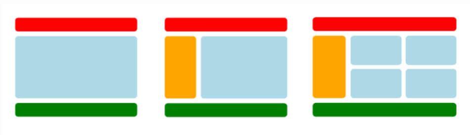

# DISPLAY
The CSS display property is a CSS feature used to determine how HTML elements are displayed. This property is used to control how an element is positioned and behaves relative to another. The display property allows you to switch between different rendering types of HTML elements, enabling them to be displayed as block, inline, or inline-block elements.

## Display Types

Commonly used display types in CSS;

1. `block`
1. `inline`
1. `inline-block`
1. `none`
1. `flex`
1. `inline-flex`
1. `grid`
1. `inline-grid`
1. `table`
1. `inline-table`
1. `list-item`

## 1. Block
It displays the element at the block level. This causes the element to take up the full width and creates line breaks before and after the element.

## 2. Inline
It displays the element inline. This causes the element to take up only as much width as its content and allows it to sit next to other elements.

## 3. Inline-block
Compared to display: inline, the biggest difference is that display: inline-block allows setting a width and height on the element.

Additionally, when display: inline-block is used, margins and paddings are respected, whereas with display: inline, margins and paddings do not affect the layout as much.

Compared to display: block, the biggest difference is that display: inline-block does not add a line break after the element, allowing it to be placed next to other elements.

## 4. None
It does not display the element. This causes the element to be invisible on the page and not take up any space.

## 5. Flex
Flex is a property used to easily position elements within a page.

For using flex, flexbox, or flexible box, a container that holds the elements needs to be defined first.

The container element is defined by setting its display property to either flex or inline-flex.

The flex property assigned to the container element gives it flexibility. This allows the child elements to be easily positioned within the container.

By default, elements are placed along a row within the container.

## 6. Inline-flex
Displays the element as an inline flex container. This allows it to behave as an inline element while retaining flex editing capabilities.

## 7. Grid

CSS Grid is a CSS layout method designed for the two-dimensional arrangement of items on a webpage or application. CSS Grid is a framework that offers much more flexibility for developers than HTML alone.

## 8. Inline-Grid

The container is defined by setting its display property to either grid or inline-grid. The defined grid value allows the elements within the container to be positioned in rows and columns. This makes it easy to position the child elements within the container.

## 9. Table
The CSS property display: table formats an HTML element to behave like a table. It allows organizing content into table cells and rows, similar to the structure of an HTML `table` element, although it does not behave exactly like one. This property is typically used for special cases that require a non-flexible layout.

## 10. Inline-Table

Displays the element as an inline table.

## 11. List-item

Displays the element as a list item.