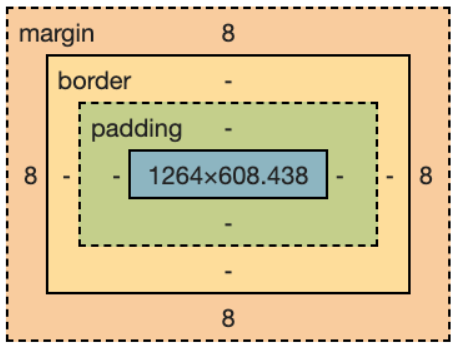

# Margin
CSS margin is a property used to adjust the outer spacing of an HTML element. Margin creates space around an element by expanding outward from its borders, creating distance between the element and neighboring elements. The margin value can be either negative or positive and can be specified in pixels, percentages, or em units.

# Padding

The CSS padding property defines the inner spacing of elements. With CSS padding , you can adjust the inner spaces around the edges of elements. You can modify the edges of an element all at once or individually.

