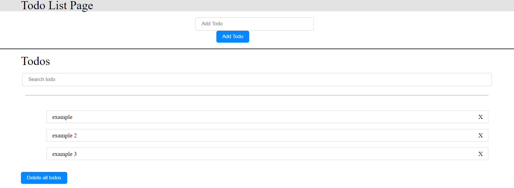
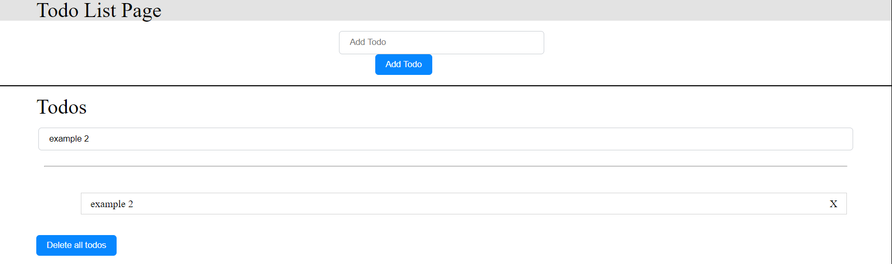
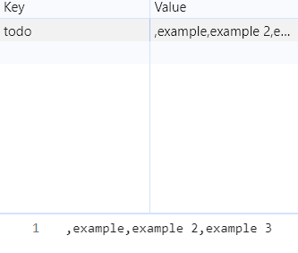

# To-Do-List
A simple To-Do-List project using HTML, CSS and JavaScript.The aim of this project is to understand the use of DOM and events.
## Features
1. Users can add tasks.
1. Users can search tasks.
1. Users can delete tasks.
1. Tasks are managed with `local storage`

## Important code blocks
The most important issue to focus on in this project is events.<br>For example, this code block deletes all todos in the project
```javascript
deleteAll.addEventListener("click", () => {
    localStorage.setItem("todo", "");

    document.querySelector("#add-todo").innerHTML = "";
  });
```
## Images
<p>Added 3 todo (examples).</p>



<p>Search todo (example 2)</p>



<p>

Created todos added to `local storage`

<p>

